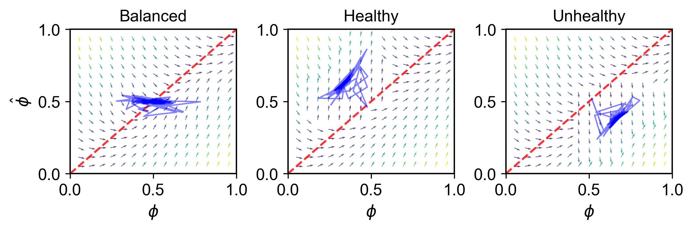

# Pseudocontingency model 
This repository contains all code required to reproduce the calibration, validation, sensitivity, and bootstrap analyses reported in the manuscript. A single script (`run_all.py`) executes the entire workflow end‑to‑end.

The paper can be cited as: 
Kaan, J., Kunz, S., Moore, S., & Khaluf, Y. (2026). Lack of group-to-individual generalizability in pseudocontingencies. Scientific Reports. https://doi.org/10.1038/s41598-026-41585-1

## 1. Overview

The project models how individuals form beliefs about the relationship between healthiness and tastiness of foods. These beliefs are shaped by biased samples of the environment, producing **pseudocontingency effects**: systematic overestimation or underestimation of statistical relationships based on base rates (pseudocontingencies) rather than actual contingencies.

This repository provides:

* A full agent-based model implemented in Mesa
* Calibration of group-level and individual-level parameters
* Validation using an independent dataset
* Sensitivity analysis across learning rates
* Bootstrap uncertainty quantification
* Plots
* A phase‑space illustration of the pseudocontingency effect

## 2. Pseudocontingencies: Short Explanation

Pseudocontingencies occur when people infer a correlation between two variables (e.g., healthiness and tastiness) from **base rates**, even when the actual contingency is zero. For example:

* If most foods encountered are tasty, and most food encountered are unhealthy,
* People tend to infer that unhealthy food is tasty.

The mechanism arises because the mind appears to implicitly multiply base rates rather than computing true covariances. In environments with strong skew, this may produce biased beliefs.

The agent-based model simulates this phenomenon by letting agents form a running estimate of the health–taste relation while sampling foods drawn from differently skewed environments (healthy, unhealthy, balanced).

The image below shows how beliefs drift toward biased attractors depending on environmental skew.




## 3. Running the Full Pipeline

All analyses can be run with:

```
python run_all.py
```

This executes:

1. **Calibration** – Fits group and individual bias parameters.
2. **Validation** – Tests predictive accuracy on an independent dataset.
3. **Plots** – Generates combined calibration/validation visualizations.
4. **Sensitivity analysis** – Computes stability across learning rates.
5. **Bootstrap** – Computes uncertainty for parameter estimates.

All scripts automatically create timestamped directories under `repo/results/`.

## 4. Key Scripts

* `agent.py` and `model.py` - The agent-based model made in Mesa
* `calibrate.py` – Group & individual calibration
* `validate.py` – Group & individual validation
* `sensitivity.py` – Learning‑rate stability
* `bootstrap.py` – Bootstrapping analysis
* `plots.py` – Plots
* `run_all.py` – Master script executing all steps

## 6. Dependencies

Install requirements (example):

```
pip install -r requirements.txt
```

## 7. Contact

For questions about the model or analyses, please contact the project authors.
